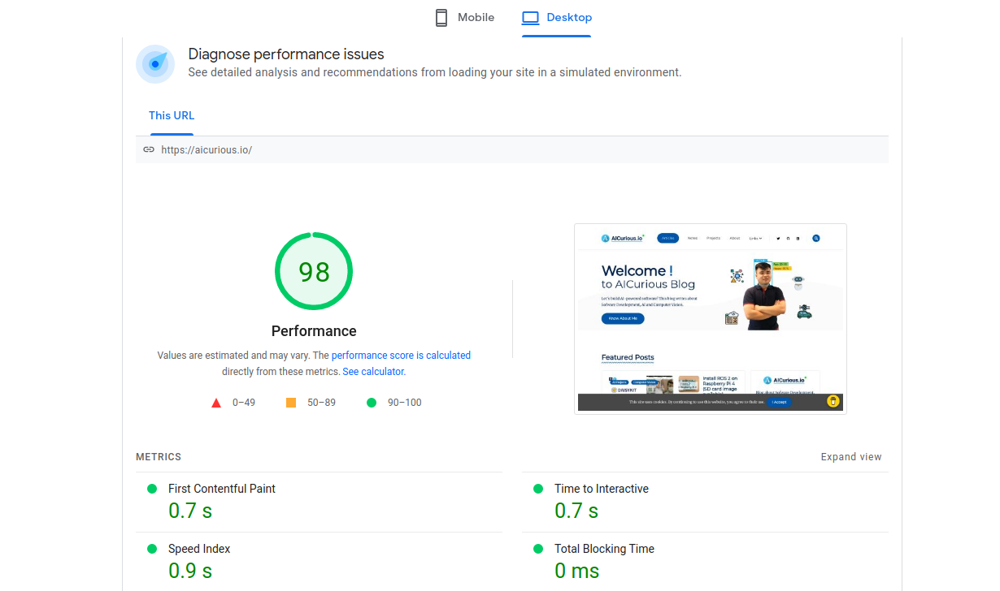
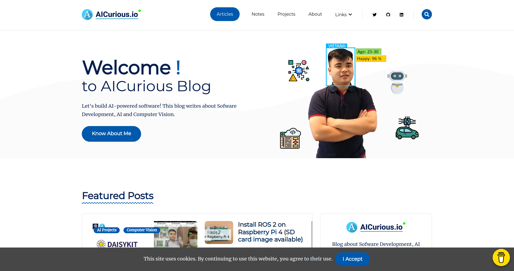

<h1 align=center>Geeky Curious | Based on <a href="https://github.com/statichunt/geeky-hugo">Geeky Hugo</a> | <a  target="_blank" href="https://pagespeed.web.dev/report?url=https%3A%2F%2Faicurious.io%2F">Page Speed 98%</a></h1>

This theme was developed based on Geeky Hugo - a beautiful HUGO theme for personal blog. I'm using this theme for my blog - [AICurious](https://aicurious.io). I opensource all my changes after optimizing it from 85% to 98% in Google Speed Insight. Hope that helps someone else.





---
## Features

- Google analytics  support
- Image optimize  with hugo pipe
- CSS and JS bundle with hugo pipe
- Netlify settings predefine
- Forestry cms pre-configured
- Google font loads from webfont loader
- Caching enable
- Color and fonts variable in config file
- Contact form support
- Search by fuse.js and mark.js
- Mailchimp integrate
- GDPR consent enable
- Google page speed optimized ( 98% )
- Open graph meta tag
- Twitter card meta tag

**New:**

- Responsive images
- Support math equations with MathJax
- Buy me a coffee
- Subscription form
- New font and styles

## Local development

```bash
# clone the repository
git clone git@github.com:gethugothemes/geeky-hugo.git

# cd in the project directory
$ cd geeky-hugo/exampleSite/

# Start local dev server
$ hugo server --themesDir ../..
```
Or Check out [Full Documentation](https://docs.gethugothemes.com/geeky/?ref=github).

## License

Copyright &copy; Designed by [Themefisher](https://themefisher.com) & Developed by
[Gethugothemes](https://gethugothemes.com)

**Code License:** Released under the [MIT](https://github.com/gethugothemes/geeky-hugo/blob/master/LICENSE) license.

**Image license:** The images are only for demonstration purposes. They have their licenses. We don't have permission to
share those images.

## Special Thanks
- [Bootstrap](https://getbootstrap.com)
- [Font Awesome Icons](https://fontawesome.com)
- [Fuse Js](https://fusejs.io)
- [Mark Js](https://markjs.io)
- [Google Fonts](https://fonts.google.com/)
- [All Contributors](https://github.com/gethugothemes/geeky-hugo/graphs/contributors)


